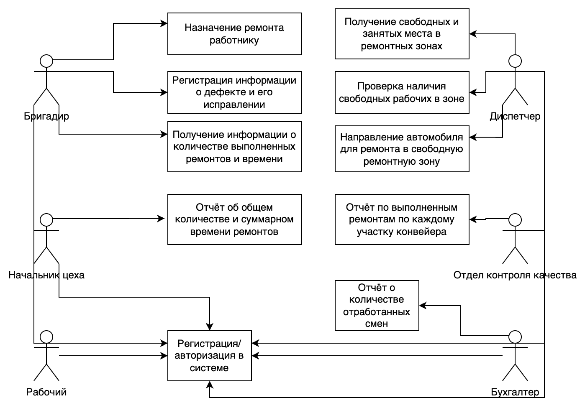

## Диаграмма случаев использования, описывающая пользователей и случаи использования разрабатываемого приложения

## Диаграмма активностей для основного бизнес-процесса, поддерживаемого приложением — регистрации и ремонта дефекта

## BPMN-диаграмма для всего бизнес-процесса завода, включая внешних его участников

